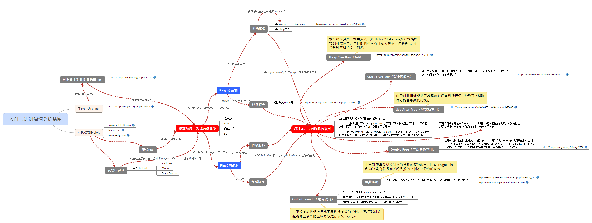

# 物联网漏洞挖掘技术

## 入门资料必备

关于对智能设备如何进行安全分析，请参考： 

绿盟 - 智能设备安全分析手册：[https://book.yunzhan365.com/tkgd/lzkp/mobile/index.html](https://book.yunzhan365.com/tkgd/lzkp/mobile/index.html)

这个是新版的attifyOS 集成了固件分析的工具:



总结的IOT资料 [https://zybuluo.com/H4l0/note/1524758](https://zybuluo.com/H4l0/note/1524758) 密码是1286



## 分析环境部署参考

### 某实验室开源分析环境：

[https://www.qiling.io/](https://www.qiling.io/)

[https://github.com/qilingframework/qiling](https://github.com/qilingframework/qiling)

### mips环境部署

[https://ray-cp.github.io/archivers/MIPS\_Debug\_Environment\_and\_Stack\_Overflow\#mips-%E6%B1%87%E7%BC%96%E5%9F%BA%E7%A1%80](https://ray-cp.github.io/archivers/MIPS_Debug_Environment_and_Stack_Overflow#mips-%E6%B1%87%E7%BC%96%E5%9F%BA%E7%A1%80) 不看里面的buidroot和网络配置

[https://wzt.ac.cn/2019/09/10/QEMU-networking](https://wzt.ac.cn/2019/09/10/QEMU-networking) 网络照这个配置

qemu-kvm

## 具体安装步骤

安装必备：qemu,binwalk,pwndbg,gdb-multiarch

可选：IDA,Ghidra,fat,交叉编译环境buildboot

### binwalk

```text
sudo apt-get update  
sudo apt-get install build-essential autoconf git

# https://github.com/devttys0/binwalk/blob/master/INSTALL.md  
git clone https://github.com/devttys0/binwalk.git  
cd binwalk

# python2.7安装  
sudo python setup.py install

# python2.7手动安装依赖库  
sudo apt-get install python-lzma

sudo apt-get install python-crypto

sudo apt-get install libqt4-opengl python-opengl python-qt4 python-qt4-gl python-numpy python-scipy python-pip  
sudo pip install pyqtgraph

sudo apt-get install python-pip  
sudo pip install capstone

# Install standard extraction utilities（必选）  
sudo apt-get install mtd-utils gzip bzip2 tar arj lhasa p7zip p7zip-full cabextract cramfsprogs cramfsswap squashfs-tools

# Install sasquatch to extract non-standard SquashFS images（必选）  
sudo apt-get install zlib1g-dev liblzma-dev liblzo2-dev  
git clone https://github.com/devttys0/sasquatch  
(cd sasquatch && ./build.sh)
```

使用命令：

```text
binwalk -Me firmware.bin
```

### qemu安装

qemu为模拟器，主要用于模拟mips程序的运行。主要有两种模式：

1. User Mode，亦称为用户模式。qemu能启动那些为不同处理器编译的Linux程序。
2. System Mode，亦称为系统模式。qemu能够模拟整个计算机系统。

qemu使用者模式mips程序共有两种模拟程序，分别是运行大端机格式的qume-mips和小端机格式的qume-mipsel，他们的执行参数都是一样的。我主要用的是用户模式。

安装命令：

```text
sudo apt-get install qemu
apt-get install qemu binfmt-support qemu-user-static
```

运行：

```text
qemu-mipsel  ./hello
```

对于没有添加静态编译选项`-static`的elf文件，在运行的时候会报错，报错为：`/lib/ld-uClibc.so.0: No such file or directory`，原因是没有库的链接，这时我们只需要找到该库，使用`qemu-mipsel -L /Your_Path/buildroot/output/target/ hello`即可运行。

对于动态调试，书上推荐的是IDA远程调试，网上教程也很多，方法也比较简单，不再描述。习惯了gdb调试的我，用不习惯ida，于是在网上找到了gdb远程调试的教程。

首先是安装pwndbg，peda对于mips的动态调试没有太好的支持。pwndbg的安装命令：

```text
git clone https://github.com/pwndbg/pwndbg
cd pwndbg
./setup.sh
```

接着是安装`gdb-multiarch`，安装命令：

```text
sudo apt-get install gdb-multiarch
```

安装完毕后，整个远程动态调试的过程为：

1. 使用命令`qemu-mipsel -g 1234 -L /Your_Path/buildroot/output/target/ hello`将程序运行起来，`-g 1234`的意思表示为监听端口1234，用于远程调试。
2. 使用`gdb-multiarch ./hello`来开启gdb。
3. 进入gdb后，使用命令`target remote 127.0.0.1:1234`，即开始调试程序。

用gdb-multiarch调试，相较于ida远程调试来说，对于用习惯了gdb调试的人来说应该会方便不少，而且还有pwndbg的支持。

### qemu-kvm安装

```text
sudo apt-get install qemu-kvm
```

### 网络配置

[https://wzt.ac.cn/2019/09/10/QEMU-networking/](https://wzt.ac.cn/2019/09/10/QEMU-networking/)

```text
apt-get install bridge-utils        # 虚拟网桥工具
apt-get install uml-utilities       # UML（User-mode linux）工具
```

```text
ifconfig <你的网卡名称(能上网的那张)> down    # 首先关闭宿主机网卡接口
brctl addbr br0                     # 添加一座名为 br0 的网桥
brctl addif br0 <你的网卡名称>        # 在 br0 中添加一个接口
brctl stp br0 off                   # 如果只有一个网桥，则关闭生成树协议
brctl setfd br0 1                   # 设置 br0 的转发延迟
brctl sethello br0 1                # 设置 br0 的 hello 时间
ifconfig br0 0.0.0.0 promisc up     # 启用 br0 接口
ifconfig <你的网卡名称> 0.0.0.0 promisc up    # 启用网卡接口
dhclient br0                        # 从 dhcp 服务器获得 br0 的 IP 地址
brctl show br0                      # 查看虚拟网桥列表
brctl showstp br0                   # 查看 br0 的各接口信息
```


## GDBserver

编译好的各架构的gdbserver:



## 常用命令

chroot . ./mydemo /usr/bin/tddp

./gdbserver \*:12345 --attach $\(pgrep smb\)

gdb-peda:c b n ni s target remote ip:port

binwalk -Me  \*.bin

file smb

which/locate/find/whereis

## qemu模拟

```text
$ sudo tunctl -t tap0 -u `whoami`  # 为了与 QEMU 虚拟机通信，添加一个虚拟网卡
$ sudo ifconfig tap0 10.10.10.1/24 # 为添加的虚拟网卡配置 IP 地址
$ qemu-system-arm -M vexpress-a9 -kernel vmlinuz-3.2.0-4-vexpress -initrd initrd.img-3.2.0-4-vexpress -drive if=sd,file=debian_wheezy_armhf_standard.qcow2 -append "root=/dev/mmcblk0p2 console=ttyAMA0" -net nic -net tap,ifname=tap0,script=no,downscript=no -nographic
```

$ sudo tunctl -t tap0 -u `whoami` \# 为了与 QEMU 虚拟机通信，添加一个虚拟网卡                                            $ sudo ifconfig tap0 10.10.10.1/24 \# 为添加的虚拟网卡配置 IP 地址                                                                   $ qemu-system-arm -M vexpress-a9 -kernel vmlinuz-3.2.0-4-vexpress -initrd initrd.img-3.2.0-4-vexpress -drive if=sd,file=debian\_wheezy\_armhf\_standard.qcow2 -append "root=/dev/mmcblk0p2 console=ttyAMA0" -net nic -net tap,ifname=tap0,script=no,downscript=no -nographic


